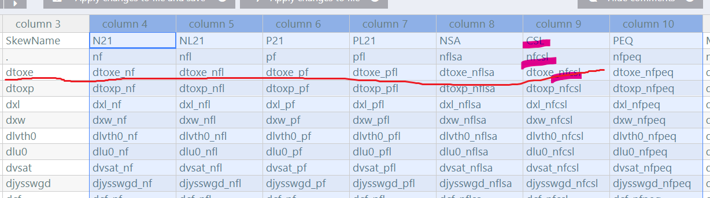
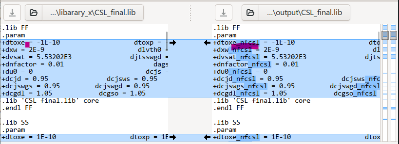

因为项目需要，要修改一些model的名字，以下是需求描述。

根据rule.csv文件的规则修改library_x目录中各个`*.lib`文件中的cell的名字，需要在对应文件中符合要求的cell名字后添加指定后缀，以`_`下划线连接。

library_x中有一些文件，如：

- cell_final.lib
- CSL_final.lib
- PEQ_final.lib

rules.csv记录了修改规则，使用excel或vscode的csv插件可以以表格形式查看，部分内容如下。忽略表格的前2列，从column 3开始。

以下统一以横向称呼行，纵向称呼列。

- column 3，SkewName 列

  从第3行到最后一行是要修改的name列表，上图中即从`dtoxe`开始往下直到最后一个有内容的单元格。

- column 4 开始描述了各个lib文件中，要修改的name需要添加什么后缀

  以`CSL`列（column 9）为例，

  1. 第1行，表示对应的`*.lib`文件名开头的前缀

     `CSL`就对应`CSL_final.lib`文件

     一些对应文件可能不存在，这里不用考虑，因为只给了部分文件，例如没有`N21_final.lib`，处理时不用考虑这个问题。

     

  2. 第2行，表示对应的`*.lib`文件中符合要求的name要添加什么后缀

     `CSL`文件中，符合要求的name要添加的后缀为`nfcsl`，注意使用`_`连接后缀。

     因为column 3中第3行到最后一行已经列出了所有name的名字，例如`dtoxe`，在`CSL_final.lib`中就统统需要添加`_nfcsl`

     

     第3行到最后一行其实就是展示了name加上后缀的名字。 `dotxe` --> `dotxe_nfcsl`，`dtoxp`--> `dtoxp_nfcsl`等等。

     

     修改前后的对比示例：

     

